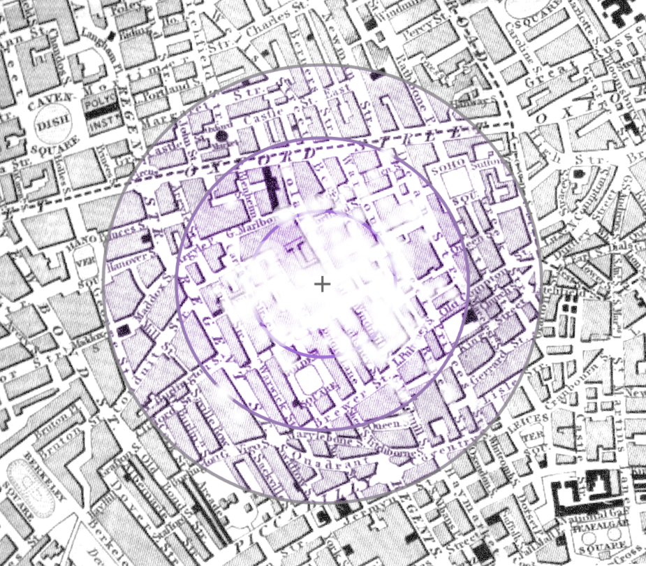

# Snow Days: Revisiting the 1854 Cholera Map

## Background

The image above does not include a title or legend, but for many in epidemiology, geography, and data visualization it is instantly recognizable as John Snow's map of the 1854 cholera outbreak in Soho, London. The map, designed by Snow and lithographer C.E. Cheffins, appeared in the second edition of Snow's  _On the mode of communication of cholera_ as one of a suite of tables and figures supporting his argument that cholera was transmitted through water and not, as competing models argued, through miasmatic air.

## Redesign

Data to recreate Snow's map is freely available online. As Drucker (2011) writes, all data are capta, and what is captured in online, machine-readable datasets is strikingly sparse, reflecting what could be digitized from the map itself. Death data contains coordinates of where the victim lived, and occasionally, their actual street address (e.g., [this cholera deaths dataset published by ESRI](https://www.arcgis.com/home/item.html?id=f39a169103da4149ae577ccceec9d125)); all of the sources I encountered fell short of the 596 deaths in Snow's study (Koch & Denike, 2010). In contrast, Snow's reports are rich with details of the neighborhood around Broad Street and its inhabitants; the dead in the texts of his monographs have names and habits (Snow, 1855). Meanwhile, Snow's table of cholera attacks and deaths by date has also been digitized, but there isn't enough information there to link individual death dates and residences. In other words, available data makes it straightforward to show _when_ people died or _where_ they lived, but not both together. Finally, pump locations and names from Snow's map are readily available.

  
_Some redesign idea sketches. Many called for data that is not readily available._

This sparsity ruled out several redesign ideas, some of which are shown above. Without dates for individual death points, I couldn't animate a map of rising death tolls. Lack of data on total building populations ruled out depicting death rates, which could have bolstered Snow's original argument by showing that the higher death count around the Broad Street pump was not solely due to higher population density. Likewise, detailed, structured information on where individuals mainly got their water could have been used in a visualization, but that data was not available either.  Finally, while it is possible to draw pump service areas based on modern London's road network, today's network differs from 1854's in both topology and travel speeds. Voronoi polygons, which divide up space into areas based on which point of interest is nearest, were another option. Snow himself employed a version of this technique for a later iteration of the cholera map (Koch & Denike, 2010).

I decided to focus on the deaths themselves, taking a fuzzier, more humanistic approach to try to represent the scale of loss: Snow's study spans nearly 600 deaths over six weeks in less than a quarter square mile, while other accounts of the outbreak describe streets where nearly every house lost someone (Fraser, 1855). To do this, I used the most complete death dataset I could find. I initially planned to overlay deaths on the original map to "decay" the streetscape, so that image loss would reflect neighborhood loss. However, the original map's stark black-and-white design left little to remove, and GIS-plotted points often left original death marks still visible. Since it would be anachronistic to use modern map tilesets, I found a contemporaneous map of London that was visually busier and georectified it for use as a basemap (Lowry, 1851). That map, unlike Snow's, was meant for navigation. Its streets are wider, its blocks are smaller, and alleys that Snow's map depicts are missing. These cartographic differences make image loss more noticeable in the redesign. They also highlight how the lightness of the original map's streets and blocks focus the viewer's attention on deaths, pumps, and select landmarks like the workhouse. For the redesign, deaths were grouped by address and symbolized as white circles that blur towards the edge, making it look like the underlying image was partially erased. Symbol sizes and the zoom level were chosen through trial and error. Lastly, I experimented with including the study boundary (digitized from the dashed line in the original map), water pumps, and tenth-mile buffers around the Broad Street pump. Including the boundary with explanatory text dispels the idea that a lack of symbols means a lack of cholera deaths in most of the map.  Adding the Broad Street pump itself helped focus attention on the cholera cluster; adding the radial buffers drew attention to how concentrated deaths were around the pump, but it also made the area look like a bomb site.

  
_What we're **not** going for: bomb aesthetics_

The resulting visualization, shown below, is still a map, but it works differently than the original. It does not try to persuade because it does not need to -- cholera is now known to be a water-borne disease, and the Broad Street pump is known as the source of the 1854 outbreak thanks to Snow's original work. Instead, it operates interpretively. While the death symbols in the redesign are proportional -- larger circles indicate addresses with higher death counts -- they blur and overlap so that a viewer would not be able to quantify the deaths, even if a map legend were provided. (Ironically, they look miasmatic.) Snow gives all of the water pumps in his map equal visual weight, affording viewers independence to parse and evaluate his argument. This redesign, in contrast, retains only the Broad Street pump to emphasize its now-settled role as the epicenter of the outbreak.

  
_**^^ STILL A DRAFT**_

## References
Drucker, J. (2011). Humanities approaches to graphical display. _Digital Humanities Quarterly_, 5(1), 1-21.

ESRI, Inc. (2020). ArcGIS Pro (Version 2.7). https://www.esri.com/en-us/arcgis/products/arcgis-pro/overview.

ESRI, Inc. (2020). Cholera cases [Data Set]. Retrieved from https://www.arcgis.com/home/item.html?id=f39a169103da4149ae577ccceec9d125.

Fraser, D. (1855). Report on the outbreak of cholera in the sub-districts of Berwick Street, Golden Square, and St. Anne's. London: George E. Eyre and William Spottiswood. Retrieved from https://collections.nlm.nih.gov/catalog/nlm:nlmuid-101196933-bk.

Koch, T., & Denike, K. (2010). Essential, Illustrative, or… Just Propaganda? Rethinking John Snow's Broad Street Map. Cartographica: The International Journal for Geographic Information and Geovisualization, 45(1), 19-31. Retrieved from http://www.ph.ucla.edu/epi/snow/catographica45(1)_19_31_2010.pdf.

Lowry, W. (1851). Map of London and its vicinity [map]. McMaster University Digital Archive. Retrieved from https://digitalarchive.mcmaster.ca/islandora/object/macrepo%3A81429

Snow, J. (1855). _On the mode of communication of cholera_. London: Churchill. Retrieved from https://play.google.com/books/reader?id=-N0_AAAAcAAJ&hl=en&pg=GBS.PA1.

Snow, J. (1855). _Report on the Cholera Outbreak in the Parish of St. James, Westminster during the Autumn of 1854._ London: Churchill. Retrieved from http://resource.nlm.nih.gov/34721190R 
